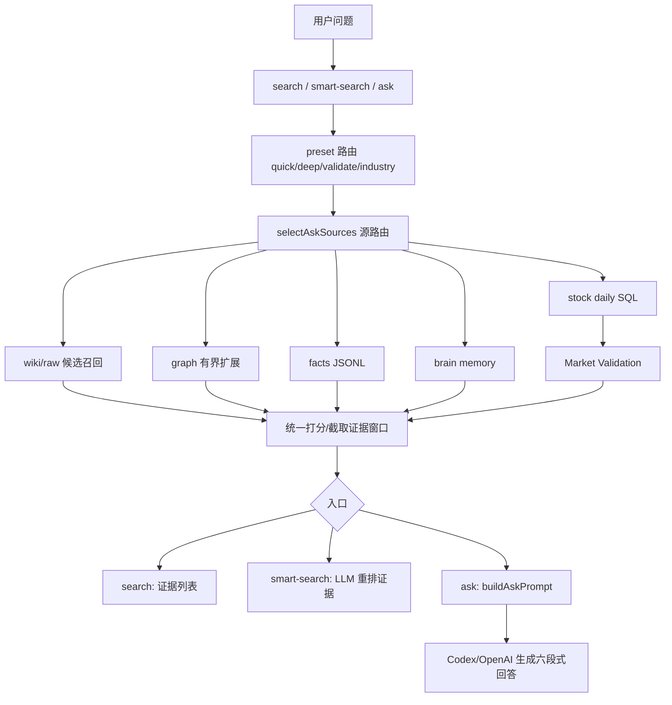

# 多源检索 RAG 完整流程

## 1. 总览

当前 Trading Review Wiki 的检索主链路拆成三档：

```text
search
  -> runAskSearch()
  -> buildAskRetrievalContext()
  -> 多源召回 / 融合 / 编号
  -> 输出人可读证据列表，不调用模型生成答案

smart-search
  -> runAskSmartSearch()
  -> LLM 生成检索计划
  -> runAskSearch() 做本地多查询召回
  -> LLM 证据重排
  -> 输出证据排序和缺口，不生成答案

ask
  -> askWiki()
  -> buildAskRetrievalContext()
  -> buildAskPrompt()
  -> Codex 或 OpenAI 生成带引用答案
```

这套系统不是单一向量库问答，而是「正式 wiki 为主知识层，raw / graph / facts / brain / SQL / vector 作为补充层」的混合检索。



关键入口：

- CLI 分发：`scripts/codex-ingest.mjs`
- 核心实现：`scripts/codex-ingest-lib.mjs`
- 实时知识库：由 `--project /path/to/wiki` 指定

## 2. 三档入口

| 命令 | 模型介入 | 输出 | 默认用途 |
|---|---|---|---|
| `search` | 不调用模型 | 人可读证据列表或 JSON | 快速查证据、查原文、看召回 |
| `smart-search` | 只做检索计划和证据重排，失败时默认退回本地检索 | 子查询、证据排序、证据缺口 | 复杂问题、产业链扩散、旧计划验证 |
| `ask` | 检索后生成最终回答 | 六段式带引用回答 | 需要直接看结论和交易含义 |

`search` 和 `smart-search` 都是证据检索，不会把片段写成结论；需要最终结论时才进入 `ask`。`smart-search --no-fallback` 可关闭默认降级。

预设：

| preset | 来源组合 | 场景 |
|---|---|---|
| `quick` | `wiki,raw,graph` | 页面、实体、精确线索 |
| `deep` | `wiki,raw,graph,facts,brain` | 综合复盘问题 |
| `validate` | `wiki,raw,graph,facts,brain,stock-price` | 旧计划验证、证伪、当前状态 |
| `industry` | `wiki,raw,graph,facts` | 产业链、题材扩散、上下游 |
| `auto` | 自动选择上面四类 | 默认 |

## 3. Source 注册层

当前支持 6 类 source：

| source | 数据位置 | 含义 | 主要角色 |
|---|---|---|---|
| `wiki_pages` | `wiki/**/*.md` | 正式 Markdown 页面 | 主知识层，概念、股票、模式、错误、策略等 |
| `raw_text` | `raw/**` | 原始资料 | 最新材料、会议纪要、研报、舆情、日复盘 |
| `wiki_graph` | `.llm-wiki/graph.json` + wikilink | 图谱关系 | 默认一跳、产业链类问题自动二跳、相关页面发现 |
| `facts_jsonl` | `data/facts/*.jsonl` | 结构化事实 | 案例、观察、验证、事实记录 |
| `brain_memory` | `data/brain/*.jsonl` | 长期记忆 | 纠错、偏好、卫语句、预测验证、自训练 |
| `stock_daily_sql` | `cn_stock_db.public.cn_stock_price_daily_wind` | 本地日线 SQL | 股价、量价、成交额、区间验证 |

默认参数：

| 参数 | 默认值 | 作用 |
|---|---:|---|
| `topWiki` | 12 | wiki 候选数量 |
| `topRaw` | 12 | raw 候选数量 |
| `graphNeighbors` | 8 | 图谱扩展数量 |
| `graphDepth` | auto | 默认一跳；产业链/上下游/受益方向/扩散等 query 自动二跳；手动可设 1/2 |
| `sourceK` | 3 | 源路由目标数量 |
| `topFacts` | 8 | facts JSONL 数量 |
| `topBrain` | 8 | brain memory 数量 |
| `sqlLimit` | 200 | SQL 最大行数 |

注意：`sourceK` 不是硬上限。规则层如果判断某些源是 required，实际 selected sources 可以超过 `sourceK`。

## 4. Source 路由层

路由函数是：

```text
selectAskSources()
```

路由分两种模式：

| 模式 | 触发条件 | 行为 |
|---|---|---|
| explicit | 用户传 `--sources wiki,raw,graph` | 完全按显式源执行 |
| auto | 默认 | 规则打分 + LLM source router + fallback |

显式别名：

| 用户输入 | 实际 source |
|---|---|
| `wiki` | `wiki_pages` |
| `raw` | `raw_text` |
| `graph` | `wiki_graph` |
| `facts` | `facts_jsonl` |
| `brain` / `memory` | `brain_memory` |
| `stock-price` / `stock` / `sql` | `stock_daily_sql` |

规则路由大致如下：

| 问题特征 | 优先源 |
|---|---|
| 普通知识库问题 | `wiki_pages`, `wiki_graph`, `brain_memory` |
| 最近、近期、本周、研报、会议、催化、订单 | `raw_text` |
| 错误、模式、复盘、高开、接盘、交易、纪律 | `wiki_pages`, `raw_text`, `wiki_graph`, `brain_memory` |
| 案例、事实、观察、验证、预测、样本 | `facts_jsonl` |
| 股价、收盘、涨跌幅、成交量、成交额、K线、近 N 日 | `stock_daily_sql` |
| 关联、关系、链路、图谱、扩展 | `wiki_graph` |

自动路由顺序：

```text
1. 规则层识别 required sources
2. 如果 provider 可用，请 LLM 做 source ranking
3. 先加入 required sources
4. 再加入 LLM 推荐 sources
5. 再按规则分数补足
6. 如果为空，fallback 到 wiki/raw/graph
```

## 5. Wiki / Raw 召回层

主召回函数：

```text
searchAskCandidates()
```

执行步骤：

```text
1. tokenizeQuery(query)
2. 扫 wiki/**/*.md
3. 扫 raw/** 文本文件
4. raw 在 ask 模式下按日期新鲜度限量扫描
5. 每个文件走 scoreFile()
6. wiki/raw 的 frontmatter 更新时间参与 ask 新鲜度评分
7. raw 根据 wiki frontmatter sources 做结构化加权
8. 排序并裁剪 topWiki/topRaw
```

### 5.1 Query 分词

`tokenizeQuery()` 会对中文做二元、三元和单字扩展。例如：

```text
物理AI机器人
```

会扩展出类似：

```text
物理, 理A, AI, 机器, 器人, 物理A, 理AI, 机器人, 物理AI机器人 ...
```

之后会用 `tokenWeight()` 降权泛词、时间词、单字噪声，保留更像交易证据的词。

### 5.2 Raw 扫描策略

raw 目录会快速膨胀，所以 ask 模式不会全量扫到底。

策略：

| 情况 | 行为 |
|---|---|
| query 带 `YYYY-MM-DD` | 优先扫这个日期命中的 raw |
| ask 模式普通问题 | 按路径日期倒序取最近一批 |
| ingest 模式 | 更偏召回，raw 上限更宽 |

这就是 ask 和 ingest 排序不同的原因：

- ask：去噪、鲜度、够用优先。
- ingest：保召回、别漏候选优先。

### 5.3 文件打分

核心函数：

```text
scoreFile()
```

打分项：

| 打分项 | 说明 |
|---|---|
| title / 文件名命中 | 高权重 |
| 正文 token 命中 | 基础相关性 |
| frontmatter 命中 | `title/aliases/tags/related/sources/summary/type` 权重更高 |
| topic coverage bonus | 多个核心词同时命中加分 |
| wiki type bonus | `概念/股票/错误/模式/策略` 加分 |
| raw path quality bonus | `研报新闻/openclaw数据/产业链复盘/投研线索/日复盘` 加分 |
| 微信聊天降权 | ask 模式降低微信聊天噪声 |
| filename recency boost | 文件名/路径里最近 7/30/90 天日期加分 |
| frontmatter freshness | 读取 `updated/last_reviewed/created`，近期加分，陈旧页面降权 |

frontmatter 字段权重：

| 字段 | 权重 |
|---|---:|
| `title` | 5 |
| `aliases` | 5 |
| `tags` | 5 |
| `related` | 6 |
| `sources` | 6 |
| `summary` | 3 |
| `type` | 2 |

frontmatter freshness 规则：

| 项 | 规则 |
|---|---|
| 时间字段 | 从 `updated / last_reviewed / created` 里取最新有效时间 |
| 近期加分 | 7/30/90 天内加分，查询含“最新/最近/订单/进展/业绩/公告/量价”等词时加分更强 |
| 陈旧降权 | `概念/股票/总结/源文档/查询` 超过 180/365 天会温和降权 |
| 稳定知识保护 | `策略/模式/错误` 不做重罚，避免老经验因为时间久被误删出上下文 |
| 调试字段 | `--show-context` 输出 `frontmatterUpdated / frontmatterUpdatedField / staleDays / freshnessScore` |

### 5.4 Wiki 牵引 Raw

系统会读取 top wiki 页面的 frontmatter `sources` 字段。

如果某个 raw 文件路径或文件名匹配这些 `sources`，则 raw 会被加分，并带上：

```text
structuredSourceMatch
```

这一步很关键。它让正式 wiki 页面可以反向牵引原始证据，而不是 raw 和 wiki 各自孤立召回。

## 6. Graph 扩展层

图谱函数：

```text
buildAskGraph()
expandAskGraph()
```

图谱来源：

| 来源 | 优先级 |
|---|---|
| `.llm-wiki/graph.json` | 优先使用 |
| wiki 页面 wikilinks | fallback / overlay |
| frontmatter `related` | 关系边 |
| frontmatter `sources` | 共源关系 |

扩展逻辑：

```text
1. 以 wikiResults 作为 seed
2. 默认找一跳 outLinks / inLinks
3. query 含产业链/上下游/受益方向/扩散等词时，自动做二跳 BFS
4. 二跳分数衰减，只保留仍命中 query token 的节点
5. hub 节点只作为一跳结果，不继续无限扩散
6. 找共享 sources 的其他页面，作为一跳同源扩展
7. 计算 graphScore
8. 排序取 graphNeighbors
```

扩展原因会写入 evidence：

```text
linked from wiki/概念/xxx.md (wikilink)
links to wiki/概念/xxx.md (wikilink)
hop 2 via wiki/概念/yyy.md: linked from ...
shared source: 2026-06-05-xxx
path_trace: wiki/概念/a.md -> wiki/概念/b.md -> wiki/概念/c.md
```

二跳只作为“关系扩展线索”，不能单独证明受益结论。个股/方向最终仍要回到 wiki/raw/facts/sql 证据验证。

图谱结果编号为：

```text
G1, G2, G3...
```

图谱不是替代正文召回，而是用来找到“同一链条上的相关节点”。

## 7. Facts JSONL 层

函数：

```text
searchAskFacts()
```

数据位置：

```text
data/facts/*.jsonl
```

执行方式：

```text
1. 逐个 JSONL 文件读取
2. 每行 JSON parse
3. 把 JSON key/value 展成搜索文本
4. tokenMatchScore + recencyBoost
5. 返回 topFacts
```

结果编号：

```text
F1, F2, F3...
```

适合回答：

- 案例
- 观察
- 事实
- 验证
- 样本
- 历史记录

## 8. Brain Memory 层

函数：

```text
searchAskBrain()
```

数据位置：

```text
data/brain/*.jsonl
```

典型文件：

```text
corrections.jsonl
predictions.jsonl
validations.jsonl
self_training_events.jsonl
preferences.jsonl
guardrails.jsonl
threads.jsonl
```

Brain Memory 的定位：

| 类型 | 作用 |
|---|---|
| correction | 纠错和反复犯错提醒 |
| prediction | 历史预测 |
| validation | 历史验证结果 |
| preference | 用户偏好 |
| guardrail | 卫语句 |
| self-training | 自训练样本 |

结果编号：

```text
M1, M2, M3...
```

约束：

```text
Brain Memory 只能作为先验、偏好、纠错、卫语句。
不能单独证明市场事实。
如果 brain 与当前证据冲突，必须写入“分歧/反证”。
```

## 9. Stock Daily SQL 层

函数：

```text
searchAskStockDaily()
buildStockDailySqlQuery()
buildStockDailyMarketValidation()
```

数据源：

```text
cn_stock_db.public.cn_stock_price_daily_wind
```

触发条件：

| query 包含 | 触发 |
|---|---|
| 股票代码 | 是 |
| 股票名 + 股价/成交量/K线/涨跌幅 | 是 |
| 最近 N 个交易日 | 是 |
| 量价/收盘/开盘/换手/成交额 | 是 |

执行步骤：

```text
1. loadStockCodeMapping()
2. parseStockDailyIntent()
3. describeStockDailySqlSource()
4. buildStockDailySqlQuery()
5. begin read only
6. 执行 SELECT
7. stockDailyRowsToEvidence()
8. buildStockDailyMarketValidation()
```

SQL 生成模式：

```sql
with recent_rows as (
  select ticker, date, open, high, low, close, pct_cng, volume, amount
  from public.cn_stock_price_daily_wind
  where ticker = any($1::text[])
  order by date desc
  limit $2
)
select *
from recent_rows
order by date asc
```

SQL 结果编号：

```text
S1, S2, S3...
```

Market Validation 会额外计算：

| 字段 | 含义 |
|---|---|
| `firstDate` / `lastDate` | 区间 |
| `firstClose` / `lastClose` | 首尾收盘价 |
| `periodReturnPct` | 区间收益 |
| `avgVolume` / `lastVolume` | 均量与末日量 |
| `lastVolumeVsAvg` | 末日量能相对均量 |
| `avgAmount` / `lastAmount` | 成交额 |
| `verdict` | 验证通过 / 验证失败 / 待继续观察 / 证据不足 |

注意：

```text
Market Validation 只是只读市场验证摘要。
不能把价格表现硬解释成基本面结论。
不会自动写回 wiki / facts / brain。
```

## 10. Evidence 编号和 Prompt 组装

核心函数：

```text
buildAskRetrievalContext()
buildAskPrompt()
```

统一编号：

| 编号 | 来源 |
|---|---|
| `N1...` | Navigation Seeds，例如 index / overview |
| `W1...` | Wiki Hits |
| `R1...` | Raw Hits |
| `G1...` | Graph Expansion |
| `F1...` | Facts JSONL Hits |
| `M1...` | Brain Memory Hits |
| `S1...` | Stock Daily SQL Hits |

每个 evidence item 会包含：

```text
ref
path
title
score
sourceId/type
nativeQuery
graphReason
excerpt/snippet
```

证据窗口截取逻辑：

```text
buildEvidenceExcerpt()
```

它会：

```text
1. 保留 compact frontmatter
2. 根据核心 token 找最多 3 个正文窗口
3. 每个窗口前后截取上下文
4. 按 source 类型控制最大字符数
```

各 source prompt 字符预算：

| source | 字符上限 |
|---|---:|
| wiki | 3600 |
| raw | 2800 |
| graph | 2200 |
| navigation | 2600 |
| facts | 1800 |
| brain | 1800 |
| SQL | 1800 |

## 11. Answer 生成层

函数：

```text
askWiki()
```

provider：

| provider | 行为 |
|---|---|
| `codex` | 调本地 Codex CLI 登录态 |
| `openai` | 调 OpenAI Responses API |

系统指令要求：

```text
必须基于提供的 wiki/raw/graph/facts/sql 检索上下文回答。
不能把常识或猜测伪装成知识库证据。
必须输出且只输出：
结论
证据链
分歧/反证
后续验证
交易含义
引用来源
```

引用要求：

```text
每个重要结论都要带来源编号。
例如 [W1]、[R2]、[G1]、[F1]、[M1]、[S1]。
```

## 12. Vector 检索的位置

当前 CLI `ask` 主链路不是纯向量 RAG。

主链路是：

```text
keyword + frontmatter structure + frontmatter freshness + recency + graph + JSONL + SQL
```

向量检索主要在前端搜索层作为 semantic boost：

```text
src/lib/search.ts
src/lib/embedding.ts
```

如果 embedding 开启：

```text
1. fetchEmbedding(query)
2. LanceDB vector_search
3. 如果命中已有结果，boost score
4. 如果没命中，不影响普通检索
5. LanceDB 失败则返回空数组
```

所以当前架构里，向量是增强层，不是唯一真相源。

## 13. Ask 与 Ingest 的区别

虽然 ask 和 ingest 共用部分底层打分函数，但策略不同。

| 维度 | ask | ingest |
|---|---|---|
| 目标 | 回答问题 | 知识化写入 |
| raw 策略 | 限量、鲜度、去噪 | 更宽召回，避免漏候选 |
| 微信聊天 | ask 降权 | ingest 视来源任务决定 |
| 输出 | 六段式回答 | staged report / manifest / changes |
| 写入 | 只读 | apply --write 才写 |
| 关注点 | 证据够用、交易含义 | 页面结构、来源归档、schema |

## 14. 调试命令

### 14.1 只看本地检索证据

```sh
npm run codex:ingest -- search \
  --query "你的问题" \
  --project /path/to/your/wiki \
  --preset auto
```

### 14.2 复杂问题智能检索

```sh
npm run codex:ingest -- smart-search \
  --query "产业链扩散或旧计划验证问题" \
  --project /path/to/your/wiki \
  --provider codex
```

### 14.3 看完整 ask 上下文

```sh
npm run codex:ingest -- ask \
  --query "你的问题" \
  --project /path/to/your/wiki \
  --sources wiki,raw,graph,brain \
  --show-context
```

### 14.4 强制 wiki/raw/graph

```sh
npm run codex:ingest -- ask \
  --query "最近一周机器人产业链有哪些变化" \
  --project /path/to/your/wiki \
  --sources wiki,raw,graph \
  --top-wiki 16 \
  --top-raw 16 \
  --graph-neighbors 10 \
  --graph-depth 2 \
  --show-context
```

### 14.5 加 brain memory

```sh
npm run codex:ingest -- ask \
  --query "最近我在高开接盘上犯过什么错误" \
  --project /path/to/your/wiki \
  --sources wiki,raw,graph,brain \
  --show-context
```

### 14.6 股价 / 量价验证

```sh
npm run codex:ingest -- ask \
  --query "绿的谐波最近20个交易日涨跌幅、成交额和量能变化" \
  --project /path/to/your/wiki \
  --sources wiki,raw,graph,stock-price \
  --show-context
```

### 14.7 只查 SQL

```sh
npm run codex:ingest -- ask \
  --query "688017 最近20个交易日日线和成交额" \
  --project /path/to/your/wiki \
  --sources stock-price \
  --show-context
```

## 15. 当前系统的核心优点

| 优点 | 解释 |
|---|---|
| 多源异构 | Markdown、raw、graph、JSONL、SQL 可以一起进入上下文 |
| 正式页优先 | wiki 是沉淀层，不会被 raw 噪声淹没 |
| raw 保鲜 | 近期会议、研报、日复盘能进入答案 |
| 图谱补漏 | 能从 seed wiki 找到关联股票、概念、模式 |
| brain 纠偏 | 历史错误和用户偏好能约束回答 |
| SQL 验证 | 叙事和量价能同屏对照 |
| 只读安全 | ask 不写 wiki/raw/brain |
| 可诊断 | `--show-context` 和 `--show-sources` 能看到每一步证据 |

## 16. 当前系统的风险点

| 风险 | 表现 | 处理方式 |
|---|---|---|
| raw 过多 | 最新 raw 可能淹没旧但重要证据 | query 带具体日期/目录/主题词 |
| wiki frontmatter 质量差 | related/sources/tags 不准、更新时间不维护会影响召回和新鲜度 | ingest 时加强 schema、sources 清洗和 `updated/last_reviewed` 维护 |
| graph 依赖页面链接 | wikilink 少则图谱弱 | 写页时补 related 和 wikilink |
| brain 可能过时 | 老纠错不一定适用新行情 | 只当先验，不当事实 |
| SQL ticker 解析失败 | 股票名/代码无法映射 | query 中明确代码 |
| vector stale | LanceDB 不同步时语义结果缺失 | 不把向量缺失当知识缺失 |

## 17. 一句话定义

这套 RAG 是：

```text
正式 wiki 做主知识层，
raw 提供最新原始证据，
graph 做关系扩展，
facts/brain 做结构化记忆，
SQL 做行情验证，
最后统一编号进入 prompt 的交易复盘型多源 RAG。
```

它的目标不是回答得像百科，而是服务交易研究里的：

```text
盘前预测
盘中执行
盘后验证
纠错沉淀
下一次更少犯错
```
